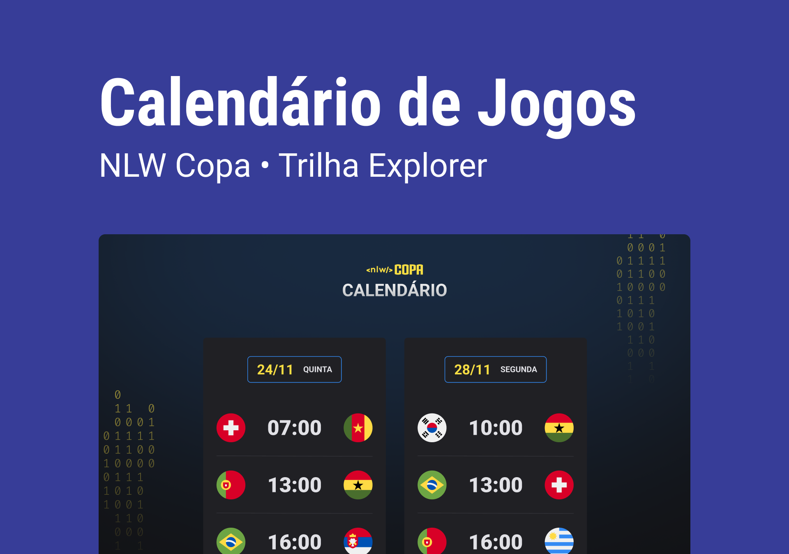

<h1 align="center"> Calendário Copa 2022 - NLW #10 </h1>

Evento exclusivo e gratuito, promovido pela Rocketseat para ensino de tecnologias WEB.

  <a href="#-tecnologias">Tecnologias</a>&nbsp;&nbsp;&nbsp;|&nbsp;&nbsp;&nbsp;
  <a href="#-projeto">Projeto</a>&nbsp;&nbsp;&nbsp;|&nbsp;&nbsp;&nbsp;
  <a href="#-layout">Layout</a>&nbsp;&nbsp;&nbsp;|&nbsp;&nbsp;&nbsp;
  <a href="#-licença">Licença</a>&nbsp;&nbsp;&nbsp;|&nbsp;&nbsp;&nbsp;
  <a href="#-autor">Autor</a>

  

 

  

## 🚀 Tecnologias

Esse projeto foi desenvolvido com as seguintes tecnologias:

- HTML e CSS
- JavaScript
- Git e GitHub

## 💻 Projeto

O Calendário da Copa é um projeto que simula a uma tabela de jogos da Copa do Mundo de 2022.

## 🔖 Layout

Você pode visualizar o layout do projeto através [DESSE LINK](https://www.figma.com/community/file/1169028052212317700). É necessário ter conta no [Figma](https://figma.com) para acessá-lo.

## 🔑 Licença

Esse projeto está sob a licença MIT.

---

## 😎 Autor

<a href="https://app.rocketseat.com.br/me/sergio-silva-lima-1567192156">
 
  
 <b>Sergio Silva Lima</b></a> <a href="https://app.rocketseat.com.br/me/sergio-silva-lima-1567192156" title="Rocketseat">🚀
</a>

Desenvolvido por 
Sergio SLima 👋🏽
Entre em contato!

Feito com a Rocketseat :wave: [Participe da comunidade!](https://discord.gg/rocketseat)
